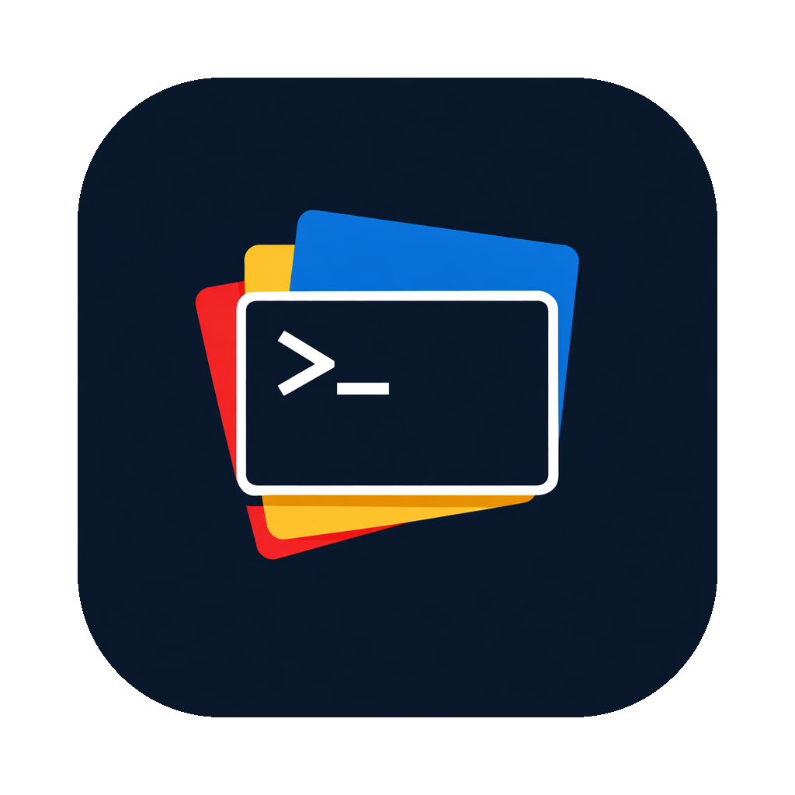
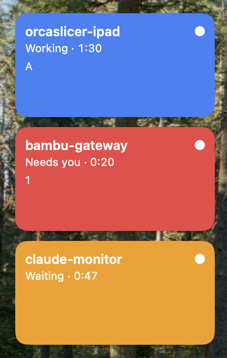

<p align="center">
  
</p>

# Claude Monitor

A native macOS menu-bar app that shows the live state of every Claude Code CLI session on your machine as a small grid of colored tiles. Leave it on your aux display and glance over when something needs you.

Each tile represents one Claude Code session and is one of four states:

| State | Color | Meaning |
|---|---|---|
| Working | blue | Claude is doing work (between `UserPromptSubmit` and `Stop`) |
| Waiting | amber | Claude finished — ball is in your court |
| Needs you | red | Claude is blocked on a permission prompt |
| Finished | grey | Session ended; tile auto-removes shortly after |

<p align="center">
  
</p>

Clicking a tile brings its Terminal.app or iTerm2 tab to the front.

## How it works

1. The app writes a hook script to `~/.claude-monitor/hook.sh` and registers it for five Claude Code hooks (`SessionStart`, `UserPromptSubmit`, `Stop`, `Notification`, `SessionEnd`) in the selected `settings.json` files.
2. When Claude Code fires a hook, the script POSTs an enriched event (session id, tty, pid, cwd) to a local HTTP server the app is running on `127.0.0.1`.
3. The app maps each event through a state machine and updates the tile.
4. Clicking a tile asks each enabled terminal provider (Terminal.app, iTerm2) over AppleScript to focus the tab/session whose `tty` matches; the first match wins.

Hook failures always exit 0 — if the app is not running, Claude is unaffected.

Only hook entries tagged with `--managed-by=claude-monitor` in the command are touched by the installer; your own hooks are left alone, and a rolling `settings.json.bak` is kept before every write.

## Multiple Claude configurations

Claude Monitor is built around the idea that you may run several Claude Code configurations side by side — for example one per client or per workspace. It auto-discovers `~/.claude` and any `~/.claudewho-*` directory that contains a `settings.json`, and lets you install or uninstall hooks into each one independently from Settings. Sessions from every managed directory land in the same dashboard.

If you juggle multiple Claude configs, pair it with [claudewho](https://github.com/frisble/claudewho) — the `~/.claudewho-*` layout Claude Monitor discovers is the one `claudewho` creates.

## Requirements

- macOS 14 or later
- [Terminal.app](https://support.apple.com/guide/terminal/welcome/mac) or [iTerm2](https://iterm2.com) (Ghostty, WezTerm, VS Code terminals, and others are not yet supported)
- [Claude Code CLI](https://docs.claude.com/en/docs/claude-code)

## Install

### Option A — download the signed DMG

Grab `ClaudeMonitor.dmg` from the [latest release](https://github.com/cliq/claude-monitor/releases/latest), open it, and drag `ClaudeMonitor.app` to `/Applications`. The build is signed with a Developer ID and notarized by Apple, so Gatekeeper won't warn you.

### Option B — build from source

Requires [XcodeGen](https://github.com/yonaskolb/XcodeGen) (`brew install xcodegen`).

```sh
make install
```

This builds a Release with ad-hoc signing, quits any running copy, replaces `/Applications/ClaudeMonitor.app`, and relaunches it.

### First launch

On first launch, the app asks which of your Claude config directories (`~/.claude`, any `~/.claudewho-*`) to install hooks into. Install hooks in the directories you use — nothing shows up in the dashboard until at least one is installed.

## Uninstalling

1. In the app, go to Settings and click **Uninstall** next to each managed directory. This removes the hook block from its `settings.json`.
2. Quit the app.
3. Remove `~/.claude-monitor/` to clean up the runtime files.
4. Remove `/Applications/ClaudeMonitor.app`.

## License

[MIT](LICENSE) © [Cliq Consulting LLC](https://www.cliqconsulting.com)
