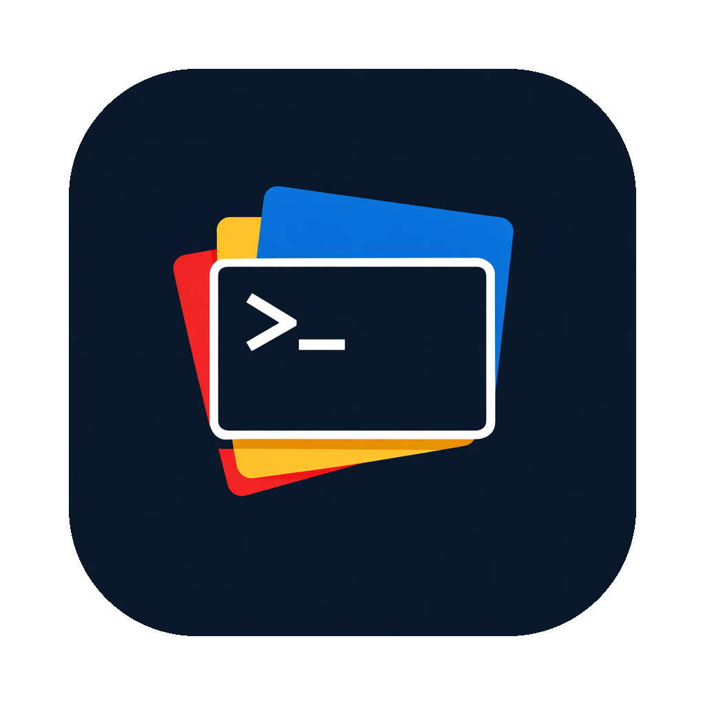
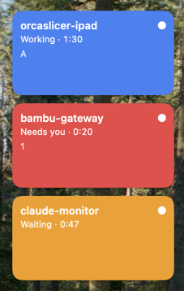
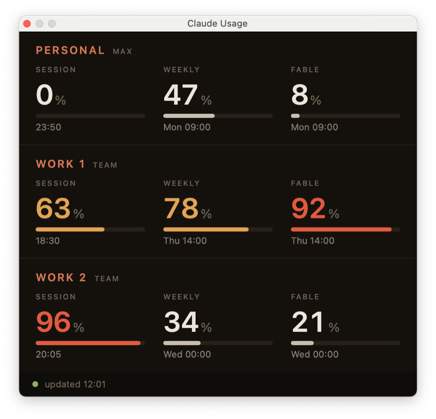
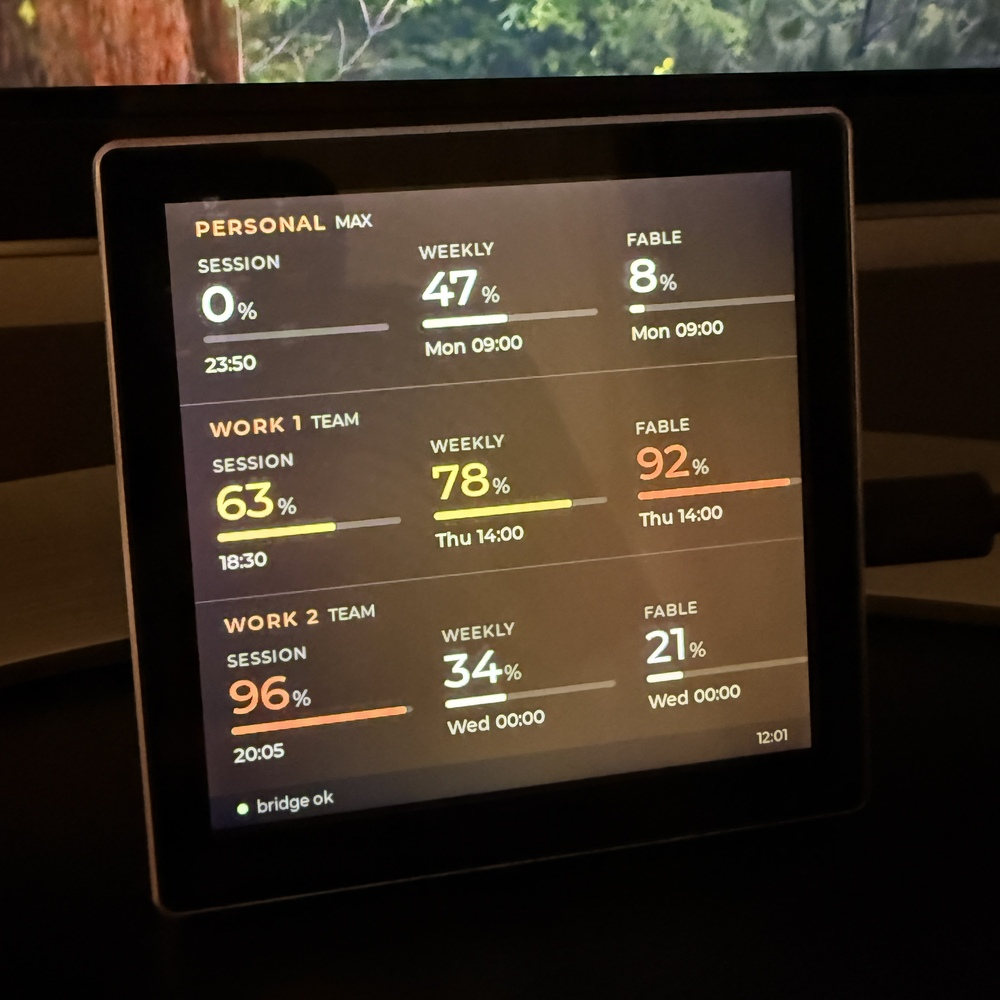

<p align="center">
  
</p>

# Claude Monitor

A native macOS menu-bar app that shows the live state of every Claude Code CLI session on your machine as a small grid of colored tiles. Leave it on your aux display and glance over when something needs you.

Each tile represents one Claude Code session and is one of five states:

| State | Color | Meaning |
|---|---|---|
| Working | blue | Claude is doing work (between `UserPromptSubmit` and `Stop`) |
| Working (background) | dimmed blue | Claude's turn ended but background tasks are still running — the tile shows the count (e.g. `Working · 2 tasks`) and no "waiting" push is sent until they finish |
| Waiting | amber | Claude finished — ball is in your court |
| Needs you | red | Claude is blocked on a permission prompt |
| Finished | grey | Session ended; tile auto-removes shortly after |

<p align="center">
  
</p>

Clicking a tile brings its Terminal.app, iTerm2, or [Orca](https://onorca.dev) tab to the front.

## How it works

1. The app writes a hook script to `~/.claude-monitor/hook.sh` and registers it for five Claude Code hooks (`SessionStart`, `UserPromptSubmit`, `Stop`, `Notification`, `SessionEnd`) in the selected `settings.json` files.
2. When Claude Code fires a hook, the script POSTs an enriched event (session id, tty, pid, cwd) to a local HTTP server the app is running on `127.0.0.1`.
3. The app maps each event through a state machine and updates the tile.
4. Clicking a tile asks each enabled terminal provider to focus the hosting tab; the first match wins. Terminal.app and iTerm2 are driven over AppleScript by `tty`; Orca is driven through its bundled CLI using the terminal handle found in the session's environment.

Hook failures always exit 0 — if the app is not running, Claude is unaffected.

Only hook entries tagged with `--managed-by=claude-monitor` in the command are touched by the installer; your own hooks are left alone, and a rolling `settings.json.bak` is kept before every write.

## Multiple Claude configurations

Claude Monitor is built around the idea that you may run several Claude Code configurations side by side — for example one per client or per workspace. It auto-discovers `~/.claude` and any `~/.claudewho-*` directory that contains a `settings.json`, and lets you install or uninstall hooks into each one independently from Settings. Sessions from every managed directory land in the same dashboard.

If you juggle multiple Claude configs, pair it with [claudewho](https://github.com/frisble/claudewho) — the `~/.claudewho-*` layout Claude Monitor discovers is the one `claudewho` creates.

## Push notifications (optional)

Get a phone push every time a session needs your attention or finishes via [Prowl](https://www.prowlapp.com/). Enable it in **Settings → Push Notifications**, paste your Prowl API key, and click **Test** to verify.

## Usage limits (optional)

Claude Monitor can also show your **usage limits** — the 5-hour session window, the weekly limit, and the weekly Opus limit for every Claude Code account it finds, plus rate-limit windows and monthly spend allowances for OpenAI Codex accounts. Enable it in **Settings → Usage** and pick the accounts you want to track.

<p align="center">
  
</p>

For Claude accounts the app reads each account's OAuth token from the Keychain (the same credentials Claude Code stores) and polls `https://api.anthropic.com/api/oauth/usage` every 180 seconds. Refreshed tokens are written back, so tracking an account here keeps it logged in — it never signs you out of Claude Code.

For Codex accounts (`~/.codex` and `~/.codexwho-*`) the app asks the Codex CLI itself via a short-lived `codex app-server` process — it never reads, refreshes, or copies Codex credentials. This requires the `codex` CLI on your machine and a ChatGPT sign-in (API-key logins are billed separately and expose no plan limits).

Toggle **Open Usage Panel** from the menu bar for a live dashboard of all accounts with reset countdowns.

The same data is served on your LAN as flat JSON (`GET http://<mac>:8737/usage`, port configurable) so an external display can render it — see below.

## ESP32 desk panel (optional)

<p align="center">
  
</p>

`firmware/` holds an always-on desk display that renders the same usage limits over WiFi. It targets the **Guition ESP32-S3-4848S040** — a 4" 480×480 IPS panel (ST7701S RGB) with an ESP32-S3 and PSRAM. It polls the macOS app's usage endpoint every 60 s and shows each account's three limits, with a mascot animation when a limit resets.

Enable the usage bridge in the app (**Settings → Usage**), then build and flash with [PlatformIO](https://platformio.org):

```sh
cd firmware
cp include/secrets.h.example include/secrets.h   # set WiFi + your Mac's http://<ip>:8737/usage
make flash        # build + upload over USB
make monitor      # serial console at 115200 baud
```

`make build` compiles without uploading. The panel firmware is a self-contained PlatformIO project — the LVGL, Arduino_GFX, and ArduinoJson dependencies are resolved on first build. The mascot animations ship as a pre-generated header (`src/mascot_gifs.h`); the pipeline that produces them is not included here.

## Requirements

- macOS 14 or later
- [Terminal.app](https://support.apple.com/guide/terminal/welcome/mac), [iTerm2](https://iterm2.com), or [Orca](https://onorca.dev) (Ghostty, WezTerm, VS Code terminals, and others are not yet supported)
- [Claude Code CLI](https://docs.claude.com/en/docs/claude-code)

## Install

### Option A — download the signed DMG

Grab `ClaudeMonitor.dmg` from the [latest release](https://github.com/cliq/claude-monitor/releases/latest), open it, and drag `ClaudeMonitor.app` to `/Applications`. The build is signed with a Developer ID and notarized by Apple, so Gatekeeper won't warn you.

### Option B — build from source

Requires [XcodeGen](https://github.com/yonaskolb/XcodeGen) (`brew install xcodegen`).

```sh
make install
```

This builds a Release with ad-hoc signing, quits any running copy, replaces `/Applications/ClaudeMonitor.app`, and relaunches it.

### First launch

On first launch, the app asks which of your Claude config directories (`~/.claude`, any `~/.claudewho-*`) to install hooks into. Install hooks in the directories you use — nothing shows up in the dashboard until at least one is installed.

## Uninstalling

1. In the app, go to Settings and click **Uninstall** next to each managed directory. This removes the hook block from its `settings.json`.
2. Quit the app.
3. Remove `~/.claude-monitor/` to clean up the runtime files.
4. Remove `/Applications/ClaudeMonitor.app`.

## License

[MIT](LICENSE) © [Cliq Consulting LLC](https://www.cliqconsulting.com)
